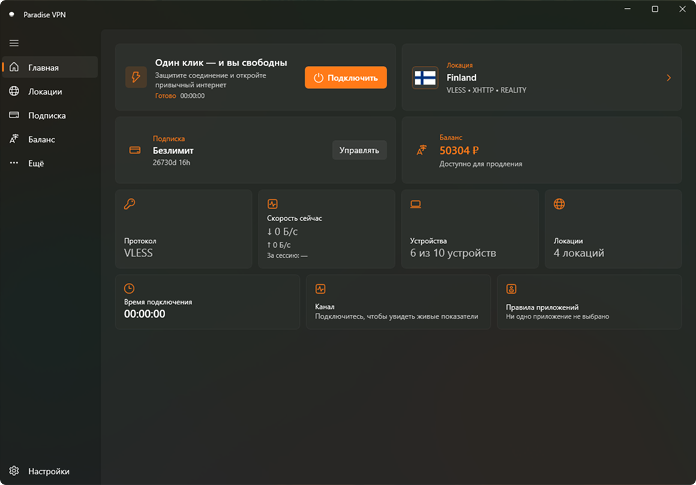

<p align="center">
<a href="https://github.com/paradise-inc-off/Paradise-VPN-Windows/stargazers"></a>
<a href="https://github.com/paradise-inc-off/Paradise-VPN-Windows/releases"></a>
<a href="https://github.com/paradise-inc-off/Paradise-VPN-Windows/releases/latest"></a>
<a href="https://github.com/paradise-inc-off/Paradise-VPN-Windows/releases/latest"></a>
</p>

<p align="center">
  
  
  <a href="https://www.virustotal.com/gui/file/15dd6f808bf74e807f148b24a81cfb0b61021c1d7218aaf662a9c18d17626781">
    
  </a>
</p>

Официальный Windows-клиент **Paradise VPN** с нативным VPN-подключением, современным интерфейсом Windows 11 и управлением аккаунтом прямо из приложения.

> Актуальная версия: **0.6.2**

---

## ✨ Возможности

* 🔐 Нативное VPN-подключение через Wintun TUN
* ⚡ Xray-core Native TUN
* 🌐 TCP / UDP, IPv4 / IPv6
* 🌍 Автоматический режим **Auto** и ручной выбор локации
* 👤 Вход и регистрация по Email
* ✈️ Авторизация через Telegram
* 🎁 Активация пробного периода
* 💳 Управление подпиской и оплатой
* 🎟️ Промокоды и баланс
* 💻 Управление подключёнными устройствами
* 🔁 Управление автопродлением
* 🎁 Реферальная система и подарки
* 💬 Обращения в поддержку
* 🚀 Автозапуск вместе с Windows
* 🇷🇺 Русский и 🇬🇧 English
* 🔄 Автоматическое обновление конфигурации серверов
* 🧭 Подробная диагностика VPN-подключения
* 🎨 Системный фон Mica и нативный интерфейс Windows 11

---

## 🔐 VPN

Paradise VPN использует нативный **Xray-core TUN** и сетевой адаптер **Wintun**.

```text
Приложения Windows
        ↓
Сетевой стек Windows
        ↓
Wintun TUN
        ↓
Xray-core
        ↓
Paradise VPN
        ↓
VPN-сервер
        ↓
Интернет
```

Приложение получает готовую конфигурацию от инфраструктуры Paradise VPN и поддерживает серверную балансировку, DNS, маршрутизацию и автоматический выбор серверов.

Режим **Auto** самостоятельно использует актуальную серверную конфигурацию, а при необходимости пользователь может выбрать конкретную локацию вручную.

Для операций с сетевым адаптером используется отдельный Tunnel Helper. Основной интерфейс приложения работает без прав администратора, а стандартное окно UAC появляется только при подключении к VPN.

---

## 👤 Аккаунт и подписка

Большинство функций Paradise VPN доступны без перехода в Telegram-бот или браузер:

* профиль;
* подписка;
* продление;
* способы оплаты;
* баланс;
* промокоды;
* подключённые устройства;
* автопродление;
* реферальная система;
* подарки;
* поддержка.

Новые пользователи могут зарегистрироваться и активировать доступный пробный период непосредственно в приложении.

---

## ⚡ Быстрое подключение

Подключение к Paradise VPN выполняется прямо с главного экрана приложения.

Главный экран позволяет:

* подключить последнюю выбранную локацию или режим `Auto`;
* отключить VPN повторным нажатием;
* видеть текущее состояние подключения;
* быстро перейти к выбору другой локации;
* проверить состояние подписки, баланс и количество устройств.

Windows запрашивает права администратора только при запуске VPN-подключения. После отключения сетевые маршруты и настройки DNS автоматически восстанавливаются.

---

## 🎨 Интерфейс

Приложение создано на современном Windows-стеке:

`C#` · `.NET 10` · `WinUI 3` · `Windows App SDK` · `Mica`

Интерфейс выполнен в нативном стиле Windows 11 с системным материалом Mica, адаптивными карточками, акцентным оранжевым цветом и плавными анимациями.

Поддерживаются разные размеры окна, полноэкранный режим, русский и английский языки, а также отдельный приветственный экран при первом запуске.

---

## 🛡️ Безопасность

Данные авторизации хранятся в защищённом хранилище **Windows Credential Locker**.

Основной процесс Paradise VPN не работает с правами администратора. Для управления Wintun, маршрутами и DNS используется отдельный Tunnel Helper, запускаемый только после подтверждения стандартного запроса Windows UAC.

Обмен между приложением и Tunnel Helper выполняется через защищённый локальный канал с одноразовым токеном.

Чувствительные серверные ключи, платёжные секреты и административные данные не хранятся внутри установщика.

---

## 📥 Установка

1. Откройте [Releases](https://github.com/paradise-inc-off/Paradise-VPN-Windows/releases).
2. Выберите последнюю версию.
3. Скачайте файл из раздела **Assets**.
4. Запустите установщик.
5. Завершите установку и откройте Paradise VPN.
6. Войдите в аккаунт или зарегистрируйтесь.
7. Выберите режим `Auto` или нужную локацию.
8. Нажмите **Подключить** и подтвердите стандартный запрос Windows UAC.

> До завершения Authenticode-подписи Windows SmartScreen может показывать предупреждение о неизвестном издателе. Проверяйте SHA-256 и скачивайте установщик только из официального репозитория Paradise VPN.

> Скачивайте Paradise VPN только из официального GitHub-репозитория, Microsoft Store или с официальных ресурсов Paradise VPN.

---

## 🧰 Требования

* Windows 11 x64
* Windows 11 22H2 или новее
* Подключение к интернету
* Права администратора для создания VPN-подключения
* Активная подписка или доступный пробный период Paradise VPN

---

## 🔗 Официальные ресурсы

🌐 **Сайт:** https://paradisevpn.su

📢 **Telegram:** [@para_dise_vpn](https://t.me/para_dise_vpn)

🤖 **Telegram-бот:** [@paradise_vpn_bot](https://t.me/paradise_vpn_bot)

👤 **Личный кабинет:** https://cabinet.paradisevpn.su

---

<p align="center">
  <b>Paradise VPN for Windows</b><br>
  Быстро. Удобно. Нативно.
</p>
